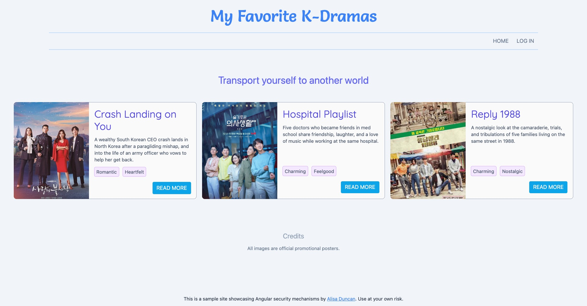

# Angular Security Code Example



This is a K-Drama fan site showcasing security mechanisms built into Angular. There's examples throughout the code, but in particular, check out `drama/comments.component.ts` and `drama/video.component.ts`.

The code in this repo is used by [There's Safety in Angular](https://alisaduncan.github.io/angular-safety) presentation.

This project was generated with [Angular CLI](https://github.com/angular/angular-cli) version 14.0.4.

## Environment setup instructions

```console
git clone 
npm ci
```

Run `ng serve` for a dev server. Navigate to `http://localhost:4200/`. The application will automatically reload if you change any of the source files.

